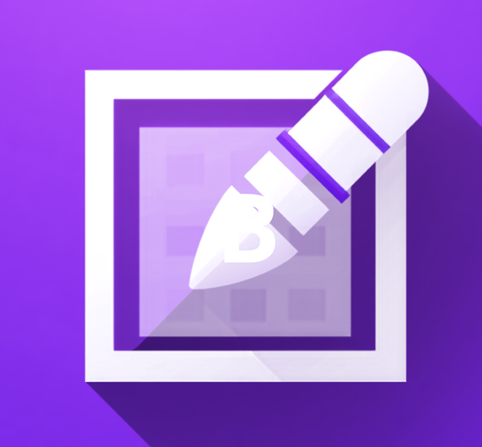
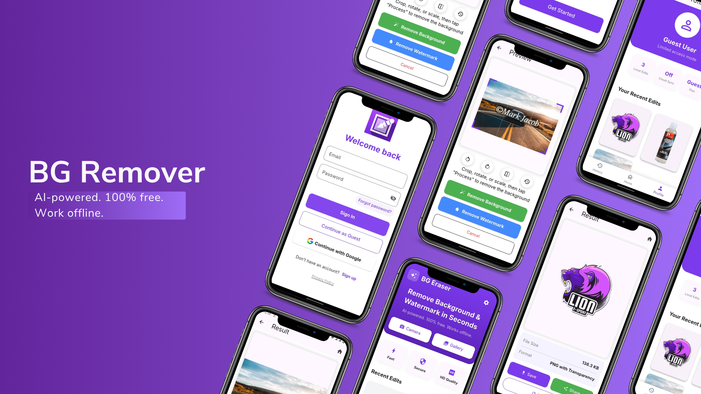
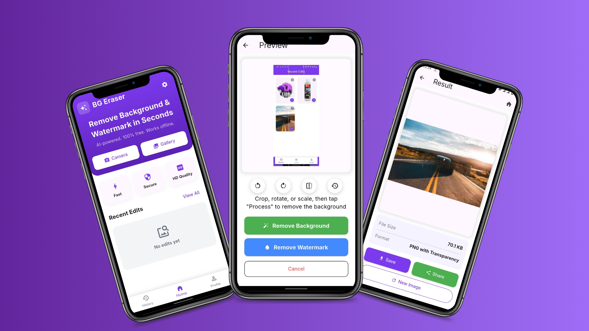
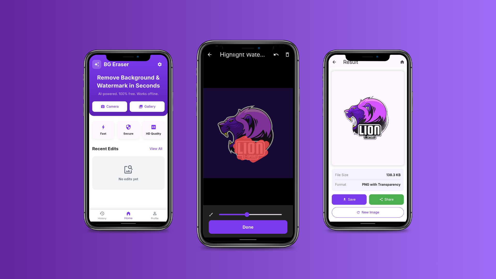

<div align="center">
  <h1>
    <picture>
      <source media="(prefers-color-scheme: dark)" srcset="https://raw.githubusercontent.com/abdula-khan16/BG-Remover/main/assets/readme/logo_dark.png">
      
    </picture>
    <br/>
    BG-Remover
  </h1>
  <h3>AI-Powered Background & Watermark Removal for Mobile</h3>
</div>

<div align="center">
  
  [](https://flutter.dev)
  [](https://dart.dev)
  [](https://supabase.com)
  [](https://github.com/abdula-khan16/BG-Remover/blob/main/LICENSE)
  []()
  [](https://github.com/abdula-khan16/BG-Remover/commits/main)
  [](https://github.com/abdula-khan16/BG-Remover/stargazers)
  [](https://github.com/abdula-khan16/BG-Remover/network/members)
  
</div>

---

## 📖 Table of Contents

*   [✨ About BG-Remover](#-about-bg-remover)
*   [🚀 Features](#-features)
    *   [Core Capabilities](#core-capabilities)
    *   [Technical Highlights](#technical-highlights)
*   [📸 Demo](#-demo)
*   [🛠️ Tech Stack](#%EF%B8%8F-tech-stack)
*   [📦 Installation](#-installation)
    *   [Prerequisites](#prerequisites)
    *   [Steps](#steps)
*   [💡 Usage](#-usage)
*   [🏛️ Architecture](#%EF%B8%8F-architecture)
*   [⚙️ Configuration](#%EF%B8%8F-configuration)
*   [🤝 Contributing](#-contributing)
*   [📜 License](#-license)
*   [💖 Acknowledgments](#-acknowledgments)
*   [👤 Connect](#-connect)

---

## ✨ About BG-Remover

**BG-Remover** is a cutting-edge, AI-driven mobile application engineered to provide seamless and efficient background and watermark removal from images. Built with the robust Flutter framework, this application prioritizes performance, privacy, and ease of use, making advanced image processing accessible directly from your Android or iOS device.

Leveraging a powerful, locally-run U²-Net ONNX model, BG-Remover performs complex image segmentation entirely offline, ensuring user data privacy and rapid processing speeds without reliance on external servers for core functionalities. Coupled with optional cloud synchronization powered by Supabase, BG-Remover offers a versatile solution for both casual users and professionals seeking reliable image manipulation on the go. Designed with an enterprise-level focus on stability and data security, BG-Remover stands as a robust tool in your digital toolkit.

---

## 🚀 Features

BG-Remover is designed with a dual focus: delivering powerful AI capabilities and ensuring a smooth, intuitive user experience.

### Core Capabilities

✅ **AI-Powered Background Removal**:
    *   Utilizes an advanced U²-Net ONNX model for precise subject segmentation, enabling high-quality background removal.
    *   Processes images 100% offline, guaranteeing utmost privacy and lightning-fast execution without data transfer.
    *   Removes backgrounds with exceptional accuracy, preserving intricate details and challenging edges.

✅ **Intelligent Watermark Removal**:
    *   Employs sophisticated algorithms to detect and intelligently remove unwanted watermarks, logos, or overlaid text.
    *   Aims to restore the integrity of images with minimal artifacting, making the removal almost imperceptible.

✅ **Multiple Input Options**:
    *   Capture new, high-resolution images directly using your device's camera.
    *   Seamlessly import existing photos from your device's gallery, supporting various image formats.

✅ **High Performance & Privacy**:
    *   All core AI processing happens exclusively on-device, ensuring your sensitive images never leave your phone.
    *   Experience lightning-fast processing times for instant results, even on complex images.

✅ **Optional Cloud Synchronization**:
    *   Securely store and sync your processed images across multiple devices using a Supabase backend.
    *   Provides data resilience, accessibility, and versioning capabilities (requires user opt-in and Supabase configuration).

### Technical Highlights

*   **Flutter Framework**: Guarantees cross-platform compatibility for Android and iOS from a single, highly maintainable codebase, accelerating development and ensuring UI consistency.
*   **On-Device AI**: Integration of a lightweight yet powerful ONNX model for efficient, offline execution of complex AI tasks directly on mobile hardware.
*   **Supabase Integration**: Provides a robust, open-source backend for optional features such as user authentication, a scalable PostgreSQL database, and cloud storage for processed images, enhancing the app's capabilities.
*   **Native Performance**: Leverages platform-specific optimizations (Kotlin for Android, Swift/Objective-C for iOS) where necessary, ensuring the application runs smoothly and efficiently.

---

## 📸 Demo

Experience the power of BG-Remover in action! Below are screenshots showcasing its intuitive interface and impressive results.

<div align="center">
  <!-- Placeholder for a GIF or static screenshots.
       Please replace with actual image paths once available. -->
  
  
  
  
  
  <br>
  <em>Screenshots showcasing background and watermark removal capabilities.</em>
</div>

---

## 🛠️ Tech Stack

BG-Remover is built upon a modern and robust technology stack, ensuring high performance, scalability, and maintainability across mobile platforms.

<div align="center">
  
  [](https://flutter.dev)
  [](https://dart.dev)
  [](https://kotlinlang.org/)
  [](https://developer.apple.com/swift/)
  [](https://supabase.com)
  [](https://www.postgresql.org/)
  [](https://gradle.org/)
  [](https://onnxruntime.ai/)
  
</div>

---

## 📦 Installation

To get a local copy of BG-Remover up and running on your development machine, follow these comprehensive steps.

### Prerequisites

Ensure you have the following software installed on your system:

*   **Flutter SDK**: [Installation Guide](https://flutter.dev/docs/get-started/install)
    *   Minimum version: 3.19.0 (check with `flutter --version`)
*   **Git**: For cloning the repository.
*   **Android Studio / Xcode**: Essential for setting up device/emulator environments and resolving platform-specific dependencies.
*   **Supabase Account (Optional)**: If you plan to enable and test cloud synchronization features, you will need an active Supabase project.

### Steps

1.  **Clone the repository**:
    Begin by cloning the BG-Remover repository to your local machine:
    ```bash
    git clone https://github.com/abdula-khan16/BG-Remover.git
    cd BG-Remover
    ```

2.  **Install Flutter dependencies**:
    Navigate to the project root and fetch all required Flutter packages:
    ```bash
    flutter pub get
    ```

3.  **Setup Supabase (Optional for cloud features)**:
    If you intend to use cloud synchronization or other Supabase-backed features:
    *   Create a new project on [Supabase.com](https://supabase.com/).
    *   Retrieve your Project URL and `anon` public key from your Supabase project settings (API section).
    *   Create a `.env` file in the root of your Flutter project (e.g., typically `lib/.env` or at the root level if configured) and add your credentials:
        ```
        SUPABASE_URL=YOUR_SUPABASE_PROJECT_URL
        SUPABASE_ANON_KEY=YOUR_SUPABASE_ANON_KEY
        ```
    *   Ensure your Flutter application's configuration (e.g., using the `flutter_dotenv` package) is set up to load these environment variables.

4.  **Run the application**:
    *   Connect a physical Android or iOS device, or start an emulator/simulator.
    *   Execute the following command from the project root to run the application:
        ```bash
        flutter run
        ```
    *   Alternatively, open the project in your preferred IDE (Android Studio or VS Code) and utilize its integrated run commands.

---

## 💡 Usage

Once the BG-Remover app is successfully installed and running on your device, utilizing its powerful features is straightforward:

1.  **Launch the App**: Tap the BG-Remover icon on your device's home screen or app drawer.
2.  **Select Image Source**:
    *   Choose the "Camera" option to capture a new photo instantly.
    *   Select "Gallery" to import an existing image from your device's photo library.
3.  **Process Image**: The app will automatically initiate its AI engine to detect and precisely remove the background or identify and intelligently erase watermarks from your selected image.
4.  **Review & Refine**: A preview of the processed image will be displayed. (Future enhancements may include manual selection or refinement tools for greater control).
5.  **Save or Share**: Save the final, clean image to your device's storage or share it directly through other applications.
6.  **Cloud Sync (Optional)**: If you have configured Supabase, your processed images can be securely synced to your cloud storage, making them accessible across your linked devices.

---

## 🏛️ Architecture

BG-Remover embraces a clean, modular, and performance-oriented architecture designed to deliver a robust and private image processing experience.

*   **Frontend (Flutter)**: The entire user interface, user experience, and application logic are crafted using the Flutter framework. This ensures a consistent, high-fidelity look and feel across both Android and iOS platforms, along with efficient state management and navigation.
*   **AI Core (ONNX Runtime)**: The heart of BG-Remover's intelligence lies in its on-device AI capabilities. The U²-Net model for precise image segmentation is integrated as an ONNX model. This model runs efficiently on device using optimized platform-specific ONNX runtimes (e.g., leveraging TensorFlow Lite or custom ONNX runtime libraries wrapped for Flutter), enabling the crucial offline processing capability that prioritizes user privacy and speed.
*   **Backend (Supabase - Optional)**: For features requiring secure cloud persistence, such as user authentication, profiles, or synchronized image storage, Supabase acts as a powerful, open-source backend. This integration provides:
    *   **PostgreSQL Database**: For robust and scalable structured data storage.
    *   **Authentication**: Secure user management and authorization.
    *   **Storage**: For storing processed images and other user-generated content in the cloud.
*   **Platform Integration**: Native code (primarily Kotlin for Android and Swift/Objective-C for iOS) is strategically utilized for specific platform features. This includes optimized camera access, seamless gallery integration, and potentially fine-tuning the loading and execution of the ONNX model for peak performance on each respective operating system.

This architectural approach ensures a performant, private, and scalable application while fully leveraging the benefits of cross-platform development with strong native integration points.

---

## ⚙️ Configuration

For optimal use of BG-Remover and to enable its optional cloud-powered features, certain configurations are required:

*   **Supabase Environment Variables**: As detailed in the [Installation](#installation) section, it is critical to set `SUPABASE_URL` and `SUPABASE_ANON_KEY` in your project's `.env` file. These variables are essential for enabling secure user authentication, cloud synchronization, and interaction with other Supabase backend services.
*   **AI Model Updates**: The core U²-Net ONNX model is bundled with the application. Enhancements or updates to the AI model will be delivered through new application versions. Users are encouraged to keep their app updated for the latest improvements.
*   **Platform-Specific Permissions**: Ensure that the necessary permissions, such as camera access and storage read/write permissions, are granted to the BG-Remover app on both Android and iOS devices. While these are typically handled by the Flutter framework and platform manifests, users may need to explicitly grant these permissions at runtime for the app to function correctly.

---

## 🤝 Contributing

We warmly welcome contributions to the BG-Remover project! Whether you're reporting a bug, suggesting a new feature, or submitting code, your input is highly valued and helps improve the application for everyone.

To contribute effectively, please follow these guidelines:

1.  **Fork the Repository**: Start by forking the official `abdula-khan16/BG-Remover` repository to your personal GitHub account.
2.  **Clone Your Fork**:
    Clone your forked repository to your local development machine:
    ```bash
    git clone https://github.com/YOUR_USERNAME/BG-Remover.git
    cd BG-Remover
    ```
3.  **Create a New Branch**:
    Create a new branch for your feature or bug fix. Use descriptive names:
    ```bash
    git checkout -b feature/your-awesome-feature
    ```
    or for a bug fix:
    ```bash
    git checkout -b bugfix/resolve-issue-description
    ```
4.  **Make Your Changes**: Implement your feature, fix the bug, or make your desired improvements. Ensure your code adheres to the project's existing coding style and best practices.
5.  **Test Your Changes**: Before submitting, thoroughly test your changes. Run any existing tests and, if applicable, add new tests to cover your modifications.
6.  **Commit Your Changes**:
    Commit your changes with a clear and concise message. Please follow the [Conventional Commits](https://www.conventionalcommits.org/en/v1.0.0/) specification:
    ```bash
    git commit -m "feat: Add new feature X to enhance user experience"
    ```
    or
    ```bash
    git commit -m "fix: Resolve bug Y causing app crash on image import"
    ```
7.  **Push to Your Fork**:
    Push your local branch to your forked repository on GitHub:
    ```bash
    git push origin feature/your-awesome-feature
    ```
8.  **Open a Pull Request**:
    Navigate to the original `abdula-khan16/BG-Remover` repository on GitHub. You should see an option to open a new Pull Request from your forked branch to the `main` branch. Provide a detailed description of your changes, why they were made, and any relevant context.

---

## 📜 License

This project is released under the **MIT License**. This permissive license allows you to use, copy, modify, merge, publish, distribute, sublicense, and/or sell copies of the software. For the full text, please see the [LICENSE](https://github.com/abdula-khan16/BG-Remover/blob/main/LICENSE) file in the repository.

---

## 💖 Acknowledgments

We extend our sincere gratitude to the following projects and communities that have made BG-Remover possible:

*   The **Flutter team** for providing an exceptional UI framework and a vibrant ecosystem for cross-platform development.
*   **Supabase** for offering a powerful, open-source backend solution that empowers our cloud synchronization features.
*   The creators of the **U²-Net model** for their significant and impactful contribution to image segmentation research, forming the core of our AI capabilities.
*   The broader **open-source community** for countless tools, libraries, and collaborative spirit that fuel innovation.

---

## 👤 Connect

<div align="center">
  <a href="https://github.com/abdula-khan16" target="_blank">
    
  </a>
</div>
